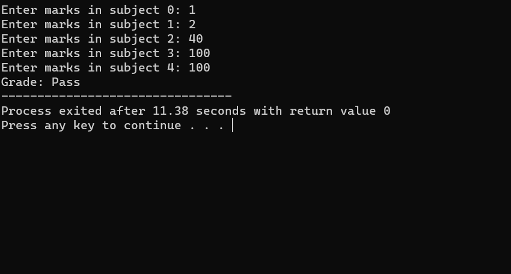
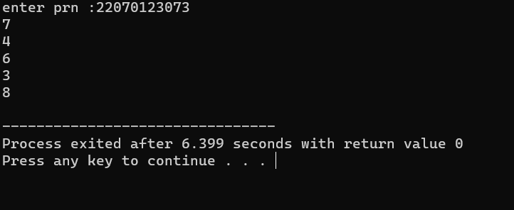
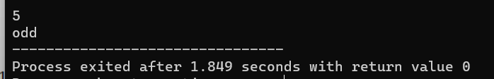
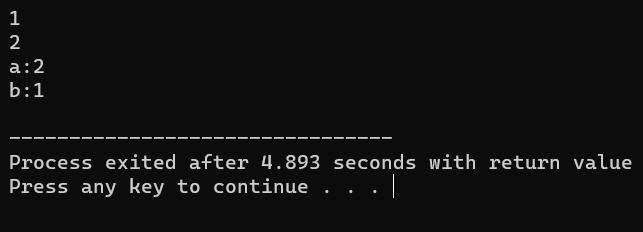

# sit_22070123073
1] [Grade](grading_system.cpp)
This C++ program calculates the average marks for five subjects, and based on the average, it assigns a grade to the student. The code uses conditional statements to determine the grade, and it covers a range of possible grade categories. This code is a basic example of grade calculation based on average marks.

  

 
2] [Digitwise Back](print_number_digitwise.cpp)
This C++ program takes a PRN as input, which is typically a multi-digit number, and it extracts and displays each digit of the PRN one by one. It uses a loop and basic arithmetic operations to accomplish this task. This code can be useful for analyzing or processing PRNs with specific digit patterns.

  

 
3] [Even or odd](find_even_pr_odd_using_bitwise.cpp)
This C++ program takes an integer as input and uses a bitwise AND operation to check whether the number is odd or even. If the least significant bit of the number is 1, it's considered odd; otherwise, it's considered even. The program then displays "Odd" or "Even" based on the result of the check.

  

 
4] [Swap](swapwithcmd.cpp)
This C++ program takes two integer inputs, swaps their values using the swap function, and then displays the swapped values of the integers. It's a basic example of how to swap two variables in C++.

  

 
